# Week 5 - Array Methods (JavaScript)

## Identitas
- Nama : `Nabila Noor Azizah`
- NIM  : `F1D022081`

---

## Deskripsi Tugas
Pada pertemuan minggu ini, fokus utamanya adalah mengenal dan mencoba **6 metode penting Array di JavaScript**.  
Method yang dipakai yaitu:
- `map()`
- `filter()`
- `reduce()`
- `find()`
- `some()`
- `every()`

---

## Dataset
Dataset diambil dari dunia **Harry Potter**, dengan dua kelompok utama:
- **Order of the Phoenix**
- **Death Eaters**

Masing-masing karakter memiliki atribut:
- `id`
- `character`
- `nickname`
- `strength`
- `specialty`

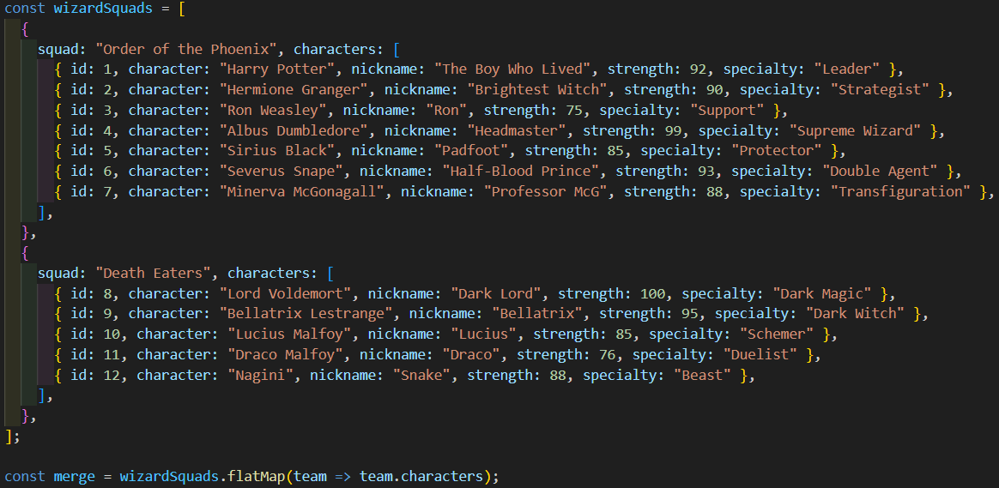

---

## Implementasi

### 1. map()
- **Tujuan**: Mengubah semua `character` menjadi huruf `kapital` (contoh transformasi data).  
- **Screenshot**:  
  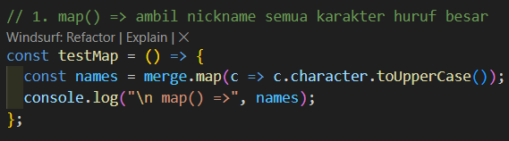

  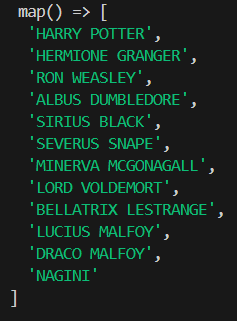

---

### 2. filter()
- **Tujuan**: Menyaring karakter dengan `strength >= 95` untuk menemukan wizard terkuat.
- **Screenshot**:  
  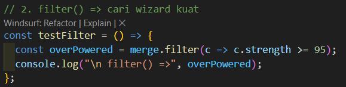
  
  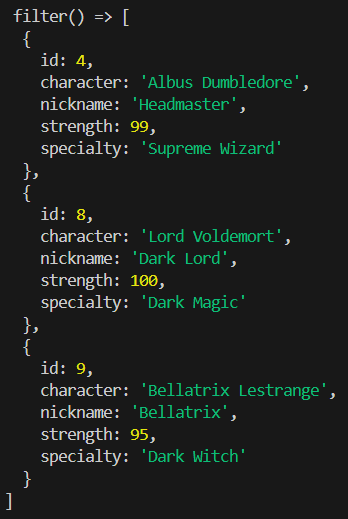

---

### 3. reduce()
- **Tujuan**: Menghitung total keseluruhan strength dari seluruh karakter.
- **Screenshot**:  
  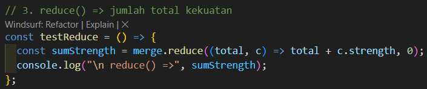
  
  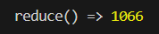

---

### 4. find()
- **Tujuan**: Menemukan karakter pertama yang mengandung nama `Harry`.
- **Screenshot**:  
  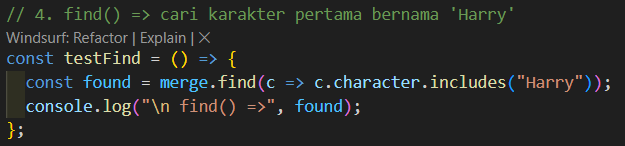
  
  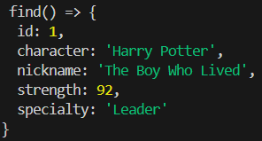

---

### 5. some()
- **Tujuan**: Mengecek apakah ada karakter dengan `specialty === "Dark Magic"`.
- **Screenshot**:  
  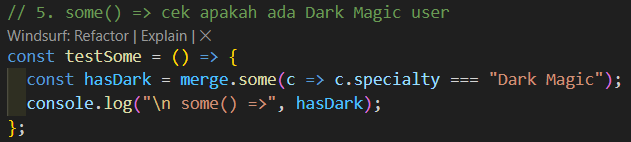
  
  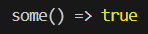

---

### 6. every()
- **Tujuan**: Mengecek apakah semua karakter memiliki `strength >= 70`.
- **Screenshot**:  
  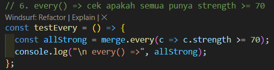
  
  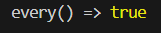

---

## Kesimpulan
Dari percobaan keenam metode array:
- `map()` sangat berguna untuk **transformasi data**.
- `filter()` dipakai untuk **menyaring data** sesuai kriteria.
- `reduce()` berguna untuk **mengagregasi/menghitung total** dari seluruh data.
- `find()` efektif untuk **mencari satu elemen spesifik**.
- `some()` membantu mengecek **apakah ada kondisi tertentu terpenuhi**.
- `every()` digunakan untuk **validasi bahwa semua elemen memenuhi kondisi**.